<h1 align="center">Full-Stack Mobile & Web Developer</h1>

###

 

  
  
  
  
  
  
  
  
  
  
  
  
  
  
  
  
  
  
  
  
  

###

 

<picture>
  <source media="(prefers-color-scheme: dark)" srcset=".github/workflows/pacman-contribution-graph-dark.svg">
  <source media="(prefers-color-scheme: light)" srcset=".github/workflows/pacman-contribution-graph.svg">
  
</picture>

###
<h2 align="center">Profile View</h1>

  

###
